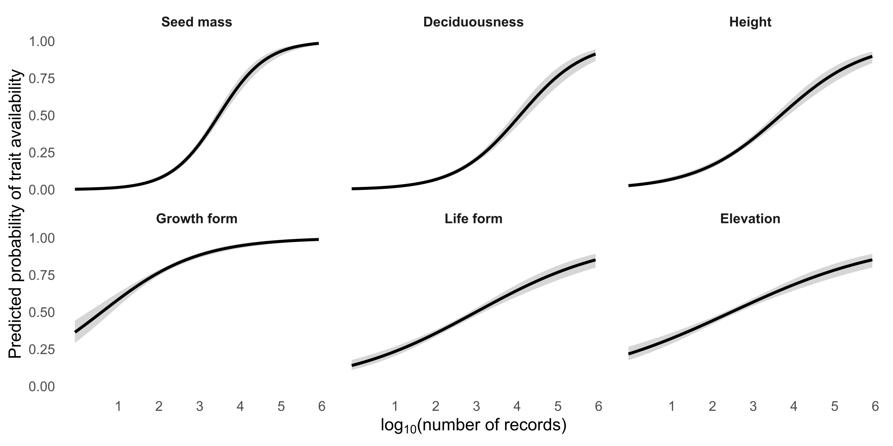
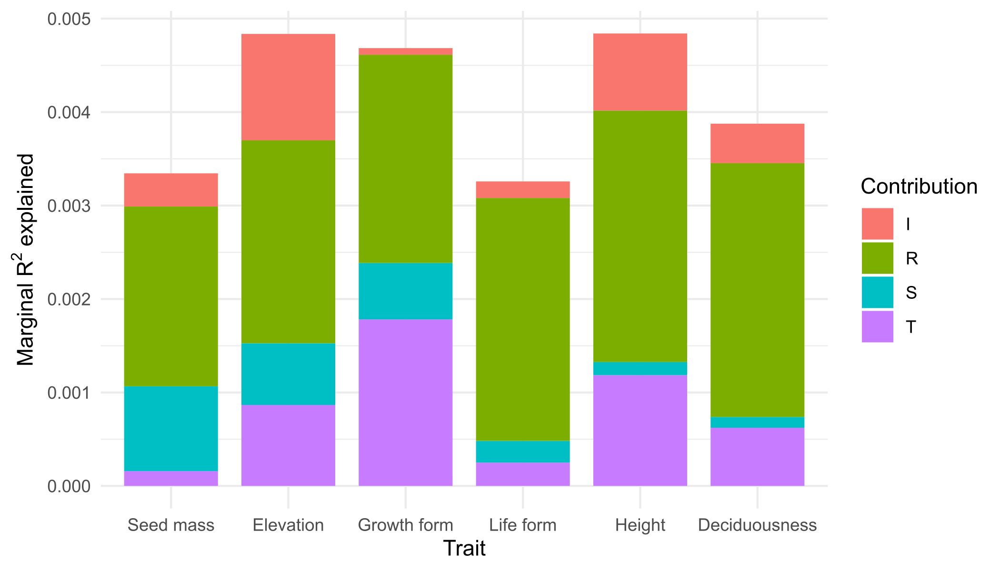
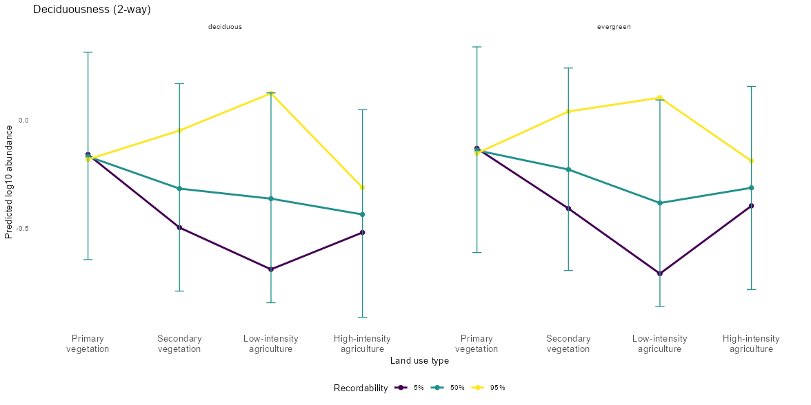
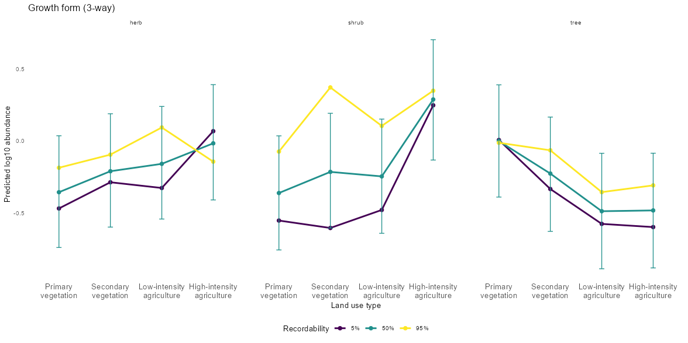
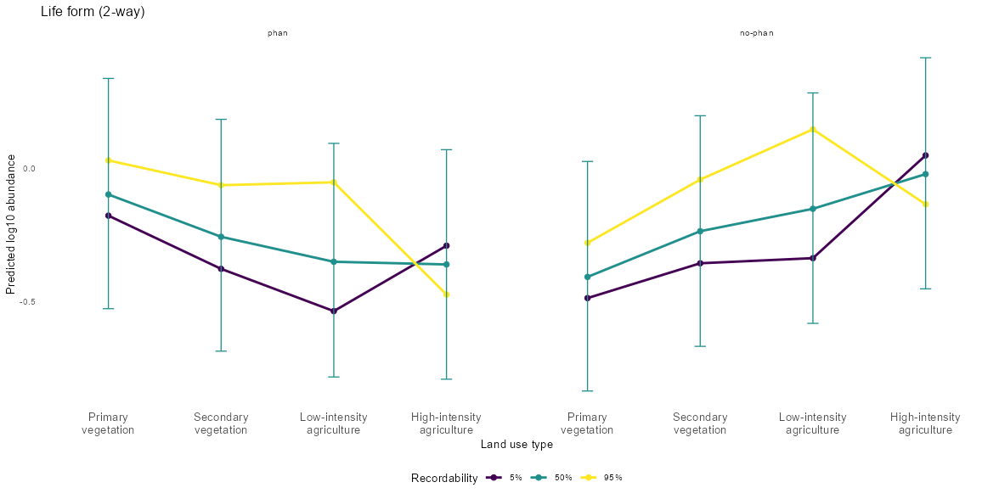
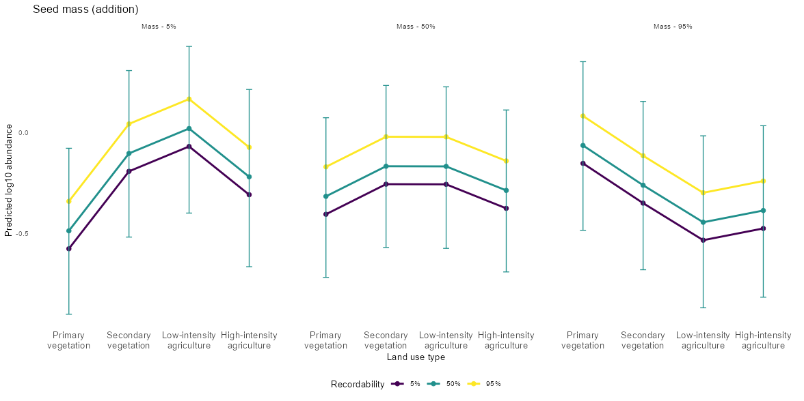
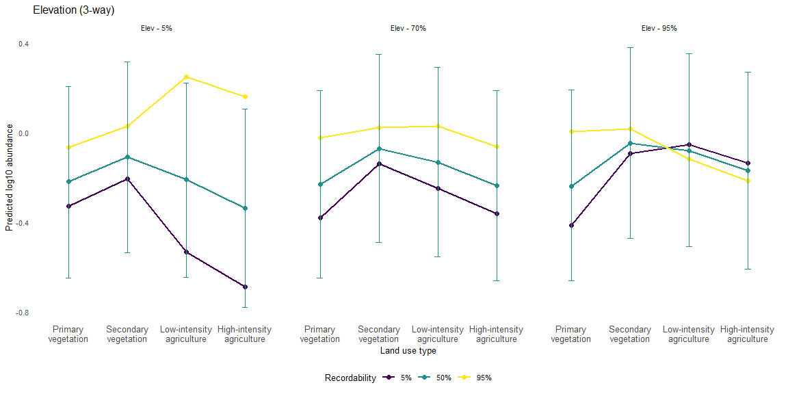
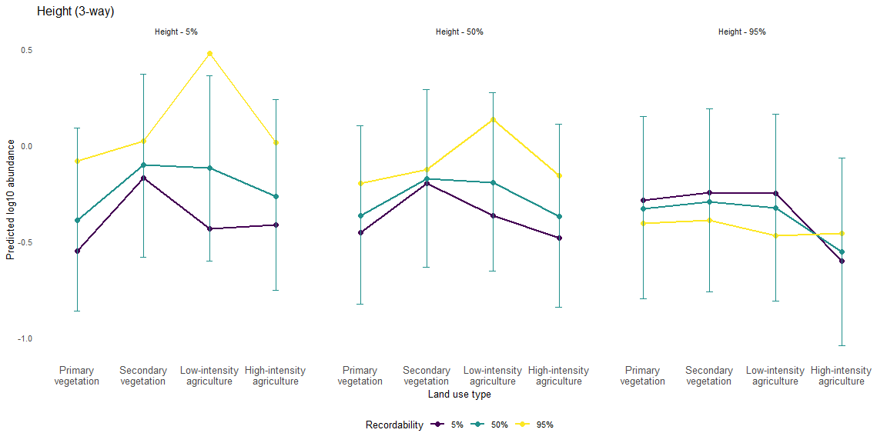

```{=html}
<style>
.toc-content { padding-left: 50px; }
body { font-size: 12px; }
pre, code { font-size: 14px; }
.title {font-size: 40px;}
h1 {font-size: 36px;}
h2 {font-size: 26px;}
h3 {font-size: 22px;}
h4 {font-size: 18px;}
h5 {font-size: 14px;}

</style>
```

```{r setup, include = FALSE}
 knitr::opts_chunk$set(echo = TRUE)
```

This document compiles the code used to obtain the results of the article “Disentangling ecological signal from species representation bias in trait-based prediction of plant responses to land-use change”.

Load R packages

```{r message=FALSE, warning=FALSE}
library(tidyverse)      # manage data and plots
library(rgbif)          # access to the GBIF database
library(GIFT)           # access to the GIFT database
library(lme4)           # linear mixed-effect models
library(lmerTest)       # provides p-values in summary tables for lme4 models
library(broom.mixed)    # model outputs in tidy data frames
library(performance)    # compare lmer models AIC, conditional and marginal Rs
library(MASS)           # produce multivariate normal distribution for CIs
library(scales)         # improve plot axis
library(knitr)          # report tables

```

# Data

## PREDICTS data

We obtained the land cover type and intensity-related abundance data compiled in the the latest version available of [PREDICTS (Contu et al., 2022; Hudson et al., 2016)](https://data.nhm.ac.uk/dataset/release-of-data-added-to-the-predicts-database-november-2022).

PREDICTS contains around 4.3 millions of observations from studies assessing the relationship between land use type and intensity and several diversity metrics (e.g. abundance, species richness and biomass among others). Since our interest is focused on comparing change in local abundance per species we filtered the observations relevant to our aim.

### Filtered PREDICTS

We filtered: a) records where the ‘Diversity metric’ of the study was ‘abundance’, b) the specific epithet is known in the ‘Best guess binomial’ column (i.e. we excluded ‘sp.’ names), and is accepted or provisionally accepted and c) we selected studies that assessed two or more of the (simpler) land use types. We simplified the land use categorisation of PREDICTS database by following the classification suggested by [Outhwaite et al 2022](https://doi.org/10.1038/s41586-022-04644-x).

```{r filtered_predicts, eval= FALSE}
# Load original PREDICTS dataset
#predicts_original = readRDS('predicts_original.rds')

table(predicts_original$Predominant_land_use)
table(predicts_original$Diversity_metric_type)

predicts_na = predicts_original %>%
  mutate(across(everything(), ~na_if(as.character(.x), "")))

predicts_filt =  predicts_na%>%
  filter(Predominant_land_use != 'Cannot decide')%>%
  filter(Predominant_land_use != 'Urban')%>%
  filter(Use_intensity!= 'Cannot decide')%>%
  filter(Diversity_metric_type == 'Abundance')%>%
  filter(!is.na(Best_guess_binomial))%>%
  filter(!is.na(Name_status)) # only accepted or provisionally accepted


# Simplified land use classification 

predicts_filt = predicts_filt %>%
  mutate(Outhwaite = case_when(
    # Primary vegetation 
    Predominant_land_use == 'Primary vegetation' ~ 'Primary vegetation',
    # Aggregate all secondary vegetation types
    Predominant_land_use %in% c(
      "Intermediate secondary vegetation",
      "Mature secondary vegetation",
      "Young secondary vegetation",
      "Secondary vegetation (indeterminate age)"
    ) ~ "Secondary vegetation",
    
    # Low-intensity agriculture
    (Predominant_land_use == "Plantation forest" & Use_intensity == "Minimal use") |
      (Predominant_land_use == "Pasture" & Use_intensity %in% c("Minimal use", "Light use")) |
      (Predominant_land_use == "Cropland" & Use_intensity %in% c("Minimal use", "Light use")) 
    ~ "Low-intensity agriculture",
    
    # High-intensity agriculture
    (Predominant_land_use == "Plantation forest" & Use_intensity %in% c("Light use", "Intense use")) |
      (Predominant_land_use == "Pasture" & Use_intensity == "Intense use") |
      (Predominant_land_use == "Cropland" & Use_intensity == "Intense use") 
    ~ "High-intensity agriculture",

    TRUE ~ NA
  ))

# Check studies have more two or comparable land uses left with original classification

comp_lu_outh = predicts_filt%>%
  group_by(Best_guess_binomial, SS)%>%
  summarise(n_landuse_types = n_distinct(Outhwaite), .groups = "drop")

comp_lu_outh %>%
  summarise(n = sum(n_landuse_types >= 2))


predicts_filt_outh = predicts_filt %>%
  inner_join(comp_lu_outh %>% 
               filter(n_landuse_types >= 2))


```

### Aggregated abundance

For each PREDICTS study, we calculated the total abundance per species at each land use type (i.e. summing across any sites with the same land use *sensu* Outhwaite et al 2022). To deal with zeros we added the minimum abundance per study to the total abundance. Also, we calculated the total effort per land cover type per study.

```{r aggregated_abundance, eval= FALSE}
predicts_abundance_agg = predicts_filt_outh %>%
  # Convert Measurement and effort back to numeric
  mutate(Measurement = as.numeric(Measurement),
         Rescaled_sampling_effort = as.numeric(Rescaled_sampling_effort)) %>%
  # Sum within Study + species + land use + intensity groups
  group_by(SS, Best_guess_binomial, Outhwaite) %>%
  mutate(
    Measurement_total = sum(Measurement, na.rm = TRUE),
    effort_total = sum(Rescaled_sampling_effort, na.rm = TRUE),
    no_sites = n()
  ) %>%
  ungroup() %>%
  # Add minimum non-zero measurement per study
  group_by(SS) %>%
  mutate(
    min_Measurement = ifelse(any(Measurement > 0), min(Measurement[Measurement > 0], na.rm = TRUE), 0), # If there’s at least one positive measurement in this study, take the minimum positive value. Otherwise, just use 0
    Measurement_nozeros = Measurement_total + min_Measurement
  ) %>%
  ungroup()

predicts_agg_reduced = predicts_abundance_agg%>%
  select(
    Source_ID, Study_number, SS, Diversity_metric, Outhwaite,
    Best_guess_binomial,
    #Aggregated metrics
    Measurement_total, Measurement_nozeros, effort_total,
    n_landuse_types, no_sites
    )%>%
  distinct()%>%
  ungroup()

```

## GBIF data

We obtained the number of records (i.e. occurrence count) of all plant species recorded in the international collaborative database [GBIF (Global Biodiversity Information Facility)](https://www.gbif.org/). The species checklist downloaded form GBIF (`gbif_plants_checklist.rds`) and the dataset of valid species with their respective taxonomy and number of records(`gbif_plants.rds`) are available as RDS files.

```{r gbif_occ_count, eval=FALSE}
#Load plant species checklist from GBIF
#gbif_plant_checklist = readRDS('gbif_plant_checklist.rds')

#Filter valid cases 
plants = gbif_plants_checklist%>%
  #blank cells are transformed to 'NA'
  mutate_all(~ na_if(., ""))%>%
  #drop cases where 'genus' and 'species' fields are NA
  drop_na(genus, species)%>%
  #select unique cases for accepted taxon to remove possible synonyms
  distinct(acceptedTaxonKey, .keep_all = TRUE)%>%
  #filter 'accepted' taxa
  filter(taxonomicStatus=='ACCEPTED')%>%
  #filter records where the recognised taxon rank is 'species'
  filter(taxonRank=='SPECIES')%>%
  #filter extinct species
  filter(iucnRedListCategory!='EX'|iucnRedListCategory!='EW')

# Obtain occurrence number
plant_checklist= as.vector(plants$species)
plant_spp_records= data.frame()
for (i in plant_checklist){
  #Get number of occurrence records 
  occ_count= as.data.frame(occ_count(scientificName = i, year="1600,2023"))
  names(occ_count)='no_records'
  occ_count$species=i
  plant_spp_records=rbind(plant_spp_records, occ_count)
}

#Add taxonomic information
plants_occ_count= merge(plants%>%
                          select(species, taxonKey, class,order, family), 
                       plant_spp_records, by = "species", all.x = TRUE)%>%
 # Remove species with zero number of records 
  filter(no_records>0)%>%
 # Rename 'species' column to join with PREDICTS data 
  rename(Best_guess_binomial = Best_guess_binomial)

gbif_plants = plants_occ_count%>%
  filter(no_records>0)%>%
 # Rename 'species' column to join with PREDICTS data 
  rename(Best_guess_binomial = species)

saveRDS(gbif_plants, 'gbif_plants.rds')

```

## GIFT data

We accessed the [The Global Inventory of Floras and Traits (GIFT)](https://gift.uni-goettingen.de/about) database via the [GIFT R package](https://besjournals.onlinelibrary.wiley.com/doi/full/10.1111/2041-210X.14213). We retrieved information on the traits metadata (available as RDS file `gift_trait_metadata.rds`) and all available traits for all species in the database (available as an RDS file `all_gift_traits.rds`).

```{r gift_traits, eval= FALSE}

# Trait information
GIFT_trait_meta = GIFT_trait_meta() 

# Download all GIFT traits
gift_traits = GIFT_trait_meta%>%
  select(Lvl3)%>% #trait numerical label 
  pull()

# data available as RDS file in data folder
all_GIFT_traits = GIFT_traits(trait_IDs = gift_traits)

```

## Suitable tratis

We restricted our analyses to those traits for which there were a minimum of 1000 observations in the PREDICTS database, where a comparison among all land use categories was represented, and where the distribution of studies for each land use category was balanced.

We joined the GBIF number of records and GIFT trait information to the PREDICTS aggregated abundance dataset by species name (available as an RDS file `plants_predicts_traits.rds`).

```{r, eval = FALSE}
#Load GIFT data
#all_GIFT_traits = readRDS('all_gift_traits.rds')

# Plant species in filtered PREDICTS
predicts_plants = predicts_filt_outh%>%
  filter(Phylum == 'Tracheophyta')%>%
  select(Best_guess_binomial)%>%
  distinct()%>%
  pull()

# Species in GIFT
gift_plants = GIFT_species()


# Species in GIFT and PREDICTS
predicts_gift_plants = gift_plants%>%
  select(work_species)%>%
  filter(work_species %in% predicts_plants)%>%
  pull()

# Filter GIFT database by relevant species
predicts_GIFT_traits = all_GIFT_traits%>%
  filter(work_species %in% predicts_gift_plants)

# Selecting only trait columns and removing all-NA columns and rows
predicts_GIFT_traits = predicts_GIFT_traits%>%
  select(1:112)%>%
  select(where(~ !all(is.na(.))))%>%
  filter(!if_all(everything(), is.na))

# Count info per trait
trait_counts = predicts_GIFT_traits %>%
  summarise(across(everything(), ~ sum(!is.na(.)))) %>%
  tidyr::pivot_longer(cols = everything(),
                      names_to = "trait",
                      values_to = "n_non_na") %>%
  arrange(desc(n_non_na))

# Rename "predicts_GIFT_traits" columns with trait name instead of trait numeric value

glimpse(GIFT_trait_meta)

trait_counts = trait_counts%>%
  mutate(ID = sub("^trait_value_", "", trait))%>%
  left_join(GIFT_trait_meta%>%select(Category, Trait1,Trait2,Lvl3, Units,type), by = c('ID' = 'Lvl3'))


rename_traits = setNames(trait_counts$trait, trait_counts$Trait2)[4:108]

predicts_GIFT_traits = predicts_GIFT_traits%>%
  rename(!!!rename_traits)

# Join PREDICTS aggregated data to GIFT data
plants_predicts_traits = predicts_agg_reduced%>%
  filter(Best_guess_binomial %in% predicts_gift_plants)%>%
  left_join(predicts_GIFT_traits%>%select(2,4:108), by = c('Best_guess_binomial' = 'work_species'))%>%
# Join GBIF number of records 
  left_join(gbif_plants%>%select(Best_guess_binomial, no_records))

```

We then identify which traits had more than a thousand observations.

```{r load-data, eval = FALSE}

#Load joint PREDICTS-GBIF-GIFT data
#plants_predicts_traits = readRDS ('plants_predicts_traits.rds')

tibble(
  position = seq_along(plants_predicts_traits),
  name = names(plants_predicts_traits))%>%
  print(n=123) 

suitable_traits = plants_predicts_traits %>%
  summarise(across(12:116, ~ sum(!is.na(.)))) %>%
  pivot_longer(
    everything(),
    names_to = "column",
    values_to = "non_na_count"
  )%>%
  filter(non_na_count>1000)
```

Based on the preliminary list of suitable traits we assessed the observation distribution across studies and land use categories.

We a created `make_pairwise_matrix` to count the number studies that compare paired land uses

```{r make_pairwise_matrix, eval = FALSE}

make_pairwise_matrix = function(data, ss_col, value_col) {
  # create all combinations within studies (ss)
  pairwise_studies = data %>%
    dplyr::distinct(.data[[ss_col]], .data[[value_col]]) %>%   # avoid duplicates
    dplyr::group_by(.data[[ss_col]]) %>%
    dplyr::summarise(
      pairs = list(combn(.data[[value_col]], 2, simplify = FALSE)),
      .groups = "drop"
    ) %>%
    tidyr::unnest(pairs) %>%
    dplyr::mutate(
      pair = purrr::map_chr(pairs, ~ paste(sort(.x), collapse = "_"))
    ) %>%
    dplyr::distinct(.data[[ss_col]], pair)
  
  # Count pairs and remove self-pairs
  pairwise_counts = pairwise_studies %>%
    dplyr::count(pair, name = "n") %>%
    tidyr::separate(pair, into = c("value1", "value2"), sep = "_") %>%
    dplyr::filter(value1 != value2)
  
  # Create non-mirrored matrix with NA
  categories = sort(unique(data[[value_col]]))
  pairwise_matrix = matrix(
    NA_real_,
    nrow = length(categories),
    ncol = length(categories),
    dimnames = list(categories, categories)
  )
  
  # Fill only [value1, value2], no mirroring
  for (i in seq_len(nrow(pairwise_counts))) {
    cat1  = pairwise_counts$value1[i]
    cat2  = pairwise_counts$value2[i]
    count = pairwise_counts$n[i]
    pairwise_matrix[cat2, cat1] = count
    pairwise_matrix[cat1, cat2] = count
  }
  
  initials = c("PV", "SV","LIA","HIA")
  
  dimnames(pairwise_matrix) = list(initials, initials)
  
  pairwise_matrix
  
}

```

The selected traits were:

-   Deciduousness (level 1 classification `Deciduousness_1`)
-   Growth form (level 1 classification `Growth_form_1`)
-   Life form (level 1 classification `Life_form_1`)
-   Minimum elevational range (`Elevational_range_min`)
-   Minimum plant height (`Plant_height_min`)
-   Mean seed mass (`Seed_mass_mean`)

For details on alternative categories within traits and units explore the appended GIFT metadata table (`GIFT_trait_metadata.rds`). The data distribution across land use types of the selected traits is described below.


### Deciduousness

```{r deci_sample, eval = FALSE}

#Load joint PREDICTS-GBIF-GIFT data
#plants_predicts_traits = readRDS ('plants_predicts_traits.rds')

which(names(plants_predicts_traits) == "Deciduousness_1")
  
deciduous_sample = plants_predicts_traits %>%
  filter(!is.na(no_records), !is.na(Deciduousness_1)) %>%
  # Remove 'variable' species, keep deciduous or evergreen species only
  filter(Deciduousness_1 != 'variable')%>%
  select(1:11,32,117)%>%  # 1:11 PREDICTS data, 32 trait, 117 no. records
  mutate(Deciduousness_1 = as.factor(Deciduousness_1))

```

```{r dec_data_distribution, eval = FALSE}

sample = deciduous_sample%>%
  select(Outhwaite, Deciduousness_1)%>%
  group_by(Outhwaite, Deciduousness_1)%>%
  count()

 kable(sample,
 caption = "Number of oservations per landuse and decisuousness type")

```

```{r deci_pairwise_comparison, eval = FALSE}

matrix = make_pairwise_matrix(deciduous_sample, "SS", "Outhwaite")

 kable(matrix,
 caption = "Number of studies that compare a given land use category pair. PV = Primary vegetation, SV= Secondary vegetation, Low-intensity agriculture, High-intensity agriculture")

```

### Growth form

```{r grow_sample, eval = FALSE}

#Load joint PREDICTS-GBIF-GIFT data
#plants_predicts_traits = readRDS ('plants_predicts_traits.rds')
  
which(names(plants_predicts_traits) == "Growth_form_1") #Column 15

plants_predicts_traits%>%
  count(Growth_form_1)

growth_sample = plants_predicts_traits %>%
  filter(!is.na(no_records), !is.na(Growth_form_1)) %>%
  # Remove 'other' species, keep tree, herb or shrub species only
  filter(Growth_form_1 != 'other')%>%
  select(1:11,15,117)%>%  # 1:11 PREDICTS data, 15 trait, 117 no. records
  mutate(Growth_form_1 = as.factor(Growth_form_1))

```

```{r grow_data_distribution, eval = FALSE}

sample = growth_sample%>%
  select(Outhwaite, Growth_form_1)%>%
  group_by(Outhwaite, Growth_form_1)%>%
  count()

 kable(sample,
 caption = "Number of oservations per landuse and decisuousness type")

```

```{r grow_pairwise_comparison, eval = FALSE}

matrix = make_pairwise_matrix(growth_sample, "SS", "Outhwaite")

 kable(matrix,
 caption = "Number of studies that compare a given land use category pair. PV = Primary vegetation, SV= Secondary vegetation, Low-intensity agriculture, High-intensity agriculture")

```

### Life form
```{r life_sample, eval = FALSE}

#Load joint PREDICTS-GBIF-GIFT data
#plants_predicts_traits = readRDS ('plants_predicts_traits.rds')
  
which(names(plants_predicts_traits) == "Life_form_1") #Column 30

plants_predicts_traits%>%
  count(Life_form_1)

life_sample = plants_predicts_traits %>%
  filter(!is.na(no_records), !is.na(Life_form_1)) %>%
  select(1:11,30,117)%>%  # 1:11 PREDICTS data, 30 trait, 117 no. records
  mutate(Life_form_1 = as.factor(Life_form_1))%>%
  # Create a new binary column grouping no-phaneropyte species
  mutate(life = relevel(factor(ifelse(Life_form_1 == "phanerophyte", "phan", "no-phan")), ref = "phan"))

```


```{r life_data_distribution, eval = FALSE}

sample = life_sample%>%
  select(Outhwaite, life)%>%
  group_by(Outhwaite, life)%>%
  count()

 kable(sample,
 caption = "Number of oservations per landuse and decisuousness type")

```

```{r life_pairwise_comparison, eval = FALSE}

matrix = make_pairwise_matrix(life_sample, "SS", "Outhwaite")

 kable(matrix,
 caption = "Number of studies that compare a given land use category pair. PV = Primary vegetation, SV= Secondary vegetation, Low-intensity agriculture, High-intensity agriculture")

```


### Seed mass (mean)

```{r seed_sample, eval = FALSE}

#Load joint PREDICTS-GBIF-GIFT data
#plants_predicts_traits = readRDS ('plants_predicts_traits.rds')
  
which(names(plants_predicts_traits) == "Seed_mass_mean") #Column 59

seed_sample = plants_predicts_traits %>%
  filter(!is.na(no_records), !is.na(Seed_mass_mean), Seed_mass_mean>0) %>%
  select(1:11,59,117) # 1:11 PREDICTS data, 59 trait, 117 no. records


```

We transformed and rescaled the mean seed mass (`Seed_mass_mean`)

```{r seed_sample rescale, eval = FALSE}

seed_sample = seed_sample%>%
  mutate(logseed = log10(Seed_mass_mean),
         logseed_sc = scale(logseed))
```

```{r seed_data_distribution, eval = FALSE}

sample = seed_sample%>%
  select(Outhwaite)%>%
  group_by(Outhwaite)%>%
  count()

 kable(sample,
 caption = "Number of observations per landuse in the Seed mass sample")

```

```{r seed_pairwise_comparison, eval = FALSE}

matrix = make_pairwise_matrix(seed_sample, "SS", "Outhwaite")

 kable(matrix,
 caption = "Number of studies that compare a given land use category pair. PV = Primary vegetation, SV= Secondary vegetation, Low-intensity agriculture, High-intensity agriculture")

```

### Elevational range (minimum)

```{r elev_sample, eval = FALSE}

#Load joint PREDICTS-GBIF-GIFT data
#plants_predicts_traits = readRDS ('plants_predicts_traits.rds')
  
which(names(plants_predicts_traits) == "Elevational_range_min") #Column 111

elev_sample = plants_predicts_traits%>%
  filter(!is.na(no_records), !is.na(Elevational_range_min))%>%
  select(1:11,111,117) # 1:11 PREDICTS data, 111 trait, 117 no. records

```

We transformed and rescaled the minimum elevational range (`Elevational_range_min`), here after 'elevation'

```{r elev_sample rescale, eval = FALSE}

elev_sample = elev_sample%>%
  mutate(logelemin = log10(Elevational_range_min+1),
         logelemin_sc = scale(logelemin))
```

```{r elev_data_distribution, eval = FALSE}

sample = elev_sample%>%
  select(Outhwaite)%>%
  group_by(Outhwaite)%>%
  count()

 kable(sample,
 caption = "Number of observations per landuse in the Elevation sample")

```

```{r elev_pairwise_comparison, eval = FALSE}

matrix = make_pairwise_matrix(elev_sample, "SS", "Outhwaite")

 kable(matrix,
 caption = "Number of studies that compare a given land use category pair. PV = Primary vegetation, SV= Secondary vegetation, Low-intensity agriculture, High-intensity agriculture")

```

### Plant height (minimum)

```{r height_sample, eval = FALSE}

#Load joint PREDICTS-GBIF-GIFT data
#plants_predicts_traits = readRDS ('plants_predicts_traits.rds')
  
which(names(plants_predicts_traits) == "Plant_height_min") #Column 22

height_sample = plants_predicts_traits %>%
  filter(!is.na(no_records), !is.na(Plant_height_min),
         Plant_height_min>0) %>%
  select(1:11,22,117) # 1:11 PREDICTS data, 22 trait, 117 no. records
```

We transformed and rescaled the minimm plant height (`Plant_height_min`), hereafter, height.

```{r height_sample rescale, eval = FALSE}
# transform and rescale
height_sample = height_sample%>%
  mutate(logheigmin = log10(Plant_height_min),
         logheigmin_sc = scale(logheigmin))
```

```{r heig_data_distribution, eval = FALSE}

sample = height_sample%>%
  select(Outhwaite)%>%
  group_by(Outhwaite)%>%
  count()

 kable(sample,
 caption = "Number of observations per landuse in the Height sample")

```

```{r heig_pairwise_comparison, eval = FALSE}

matrix = make_pairwise_matrix(height_sample, "SS", "Outhwaite")

 kable(matrix,
 caption = "Number of studies that compare a given land use category pair. PV = Primary vegetation, SV= Secondary vegetation, Low-intensity agriculture, High-intensity agriculture")

```

#  Analyses

## Trait availability and recordability
We tested whether trait availability is associated with species recordability. We modelled the probability of a species having trait information as a function of recordability using binomial mixed models (trait  status ~ recordability), where trait status (`ingift`) represents the presence or absence of trait information in GIFT, and recordability is the centred log10-transformed number of GBIF records(`ctrlogrec`).

First, to centre the log10-transformed values, we calculate the mean of the predicts sample (`overall_ctr`). 

```{r overall_mean, eval =FALSE}

overall_ctr = predicts_agg_reduced%>%
  # Filter all aggregated abundance observation of plant species
  filter(Best_guess_binomial %in% predicts_plants)%>%
  # Add number of records and transform
  left_join(gbif_plants%>%
              select(Best_guess_binomial, no_records))%>%
  # Estimate sample mean
  mutate(overall_ctr = mean(log10(no_records), na.rm = TRUE))%>%
  distinct(overall_ctr)%>%
  pull(overall_ctr)

overall_ctr

```


Next, we get the per-trait sample of plants species in PREDICTS with number of records and respective presence/absence status in GIFT.

*Deciduousness*

```{r deci_recordability, eval = FALSE}

# list of species with trait information
deci_spp = deciduous_sample%>%
  select(Best_guess_binomial)%>%
  distinct()%>%
  pull()

# Sample of plants species in PREDICTS with no. of records and presence/absence status in GIFT

predicts_deci_abund = predicts_agg_reduced%>%
  # Filter all aggregated abundance observation of plant species
  filter(Best_guess_binomial %in% predicts_plants)%>%
  # Add GIFT presence/absence column
  mutate(ingift = ifelse(Best_guess_binomial %in% deci_spp, 1, 0))%>%
  # Add number of records and transform
  left_join(gbif_plants%>%
              select(Best_guess_binomial, no_records))%>%
  mutate(log10no_records = log10(no_records),
         ctrlogrec = log10no_records- overall_ctr)%>%
  filter(!is.na(ctrlogrec))
```
We then tested whether recordability predicts trait availability

```{r deci_cover_model, eval = FALSE}

species_deci = predicts_deci_abund %>%
  select(Best_guess_binomial, ctrlogrec, ingift) %>%
  distinct()

deci_cover = glm(ingift ~ ctrlogrec,
                            data = species_deci,
                            family = binomial)
summary(deci_cover)

```

Species recordability strongly predicted deciduousness data availability (estimate = 1.27, +-0.08 SE, p \<2e-16).

We repeat these for the rest of the traits:

*Growth form*

```{r growth_recordability, eval = FALSE}

# list of species with trait information
grow_spp = growth_sample%>%
  select(Best_guess_binomial)%>%
  distinct()%>%
  pull()

# Sample of plants species in PREDICTS with no. of records and presence/absence status in GIFT

predicts_grow_abund = predicts_agg_reduced%>%
  # Filter all aggregated abundance observation of plant species
  filter(Best_guess_binomial %in% predicts_plants)%>%
  # Add GIFT presence/absence column
  mutate(ingift = ifelse(Best_guess_binomial %in% grow_spp, 1, 0))%>%
  # Add number of records and transform
  left_join(gbif_plants%>%
              select(Best_guess_binomial, no_records))%>%
  mutate(log10no_records = log10(no_records),
         ctrlogrec = log10no_records- overall_ctr)%>%
  filter(!is.na(ctrlogrec))
```

```{r growth_cover_model, eval = FALSE}

species_grow = predicts_grow_abund %>%
  select(Best_guess_binomial, ctrlogrec, ingift) %>%
  distinct()

grow_cover = glm(ingift ~ ctrlogrec,
                            data = species_grow,
                            family = binomial)
summary(grow_cover)
```

Species recordability strongly predicted growth-form data availability (estimate = 0.84, +-0.07 SE, p \<2e-16).

*Life form*

```{r life_recordability, eval = FALSE}

# list of species with trait information
life_spp = life_sample%>%
  select(Best_guess_binomial)%>%
  distinct()%>%
  pull()

# Sample of plants species in PREDICTS with no. of records and presence/absence status in GIFT

predicts_life_abund = predicts_agg_reduced%>%
  # Filter all aggregated abundance observation of plant species
  filter(Best_guess_binomial %in% predicts_plants)%>%
  # Add GIFT presence/absence column
  mutate(ingift = ifelse(Best_guess_binomial %in% life_spp, 1, 0))%>%
  # Add number of records and transform
  left_join(gbif_plants%>%
              select(Best_guess_binomial, no_records))%>%
  mutate(log10no_records = log10(no_records),
         ctrlogrec = log10no_records- overall_ctr)%>%
  filter(!is.na(ctrlogrec))
```

```{r life_cover_model, eval = FALSE}

species_life = predicts_life_abund %>%
  select(Best_guess_binomial, ctrlogrec, ingift) %>%
  distinct()

life_cover = glm(ingift ~ ctrlogrec,
                            data = species_life,
                            family = binomial)
summary(life_cover)
```

Species recordability strongly predicted life-form data availability (estimate = 0.59, +-0.05 SE, p \<2e-16).


*Seed mass*

```{r seed_recordability, eval = FALSE}

# list of species with trait information
seed_spp = seed_sample%>%
  select(Best_guess_binomial)%>%
  distinct()%>%
  pull()

# Sample of plants species in PREDICTS with no. of records and presence/absence status in GIFT

predicts_seed_abund = predicts_agg_reduced%>%
  # Filter all aggregated abundance observation of plant species
  filter(Best_guess_binomial %in% predicts_plants)%>%
  # Add GIFT presence/absence column
  mutate(ingift = ifelse(Best_guess_binomial %in% seed_spp, 1, 0))%>%
  # Add number of records and transform
  left_join(gbif_plants%>%
              select(Best_guess_binomial, no_records))%>%
  mutate(log10no_records = log10(no_records),
         ctrlogrec = log10no_records- overall_ctr)%>%
  filter(!is.na(ctrlogrec))
```


```{r seed_cover_model, eval = FALSE}

species_seed = predicts_seed_abund %>%
  select(Best_guess_binomial, ctrlogrec, ingift) %>%
  distinct()

seed_cover = glm(ingift ~ ctrlogrec,
                            data = species_seed,
                            family = binomial)
summary(seed_cover)
```

Species recordability strongly predicted life-form data availability (estimate = 1.71, +-0.09 SE, p \<2e-16).

*Elevation*

```{r elev_recordability, eval = FALSE}

# list of species with trait information
elev_spp = elev_sample%>%
  select(Best_guess_binomial)%>%
  distinct()%>%
  pull()

# Sample of plants species in PREDICTS with no. of records and presence/absence status in GIFT

predicts_elev_abund = predicts_agg_reduced%>%
  # Filter all aggregated abundance observation of plant species
  filter(Best_guess_binomial %in% predicts_plants)%>%
  # Add GIFT presence/absence column
  mutate(ingift = ifelse(Best_guess_binomial %in% elev_spp, 1, 0))%>%
  # Add number of records and transform
  left_join(gbif_plants%>%
              select(Best_guess_binomial, no_records))%>%
  mutate(log10no_records = log10(no_records),
         ctrlogrec = log10no_records- overall_ctr)%>%
  filter(!is.na(ctrlogrec))
```

```{r elev_cover_model, eval = FALSE}

species_elev = predicts_elev_abund %>%
  select(Best_guess_binomial, ctrlogrec, ingift) %>%
  distinct()

elev_cover = glm(ingift ~ ctrlogrec,
                            data = species_elev,
                            family = binomial)
summary(elev_cover)
```

Species recordability strongly predicted life-form data availability (estimate = 0.506, +-0.05 SE, p \<2e-16).

*Plant height*

```{r heig_recordability, eval = FALSE}

# list of species with trait information
heig_spp = height_sample%>%
  select(Best_guess_binomial)%>%
  distinct()%>%
  pull()

# Sample of plants species in PREDICTS with no. of records and presence/absence status in GIFT

predicts_heig_abund = predicts_agg_reduced%>%
  # Filter all aggregated abundance observation of plant species
  filter(Best_guess_binomial %in% predicts_plants)%>%
  # Add GIFT presence/absence column
  mutate(ingift = ifelse(Best_guess_binomial %in% heig_spp, 1, 0))%>%
  # Add number of records and transform
  left_join(gbif_plants%>%
              select(Best_guess_binomial, no_records))%>%
  mutate(log10no_records = log10(no_records),
         ctrlogrec = log10no_records- overall_ctr)%>%
  filter(!is.na(ctrlogrec))
```


```{r heig_cover_model, eval = FALSE}

species_heig = predicts_heig_abund %>%
  select(Best_guess_binomial, ctrlogrec, ingift) %>%
  distinct()

heig_cover = glm(ingift ~ ctrlogrec,
                            data = species_heig,
                            family = binomial)
summary(heig_cover)
```

Species recordability strongly predicted life-form data availability (estimate = 0.966, +-0.06 SE, p \<2e-16).

### Probability plot 

We use the binomial models to plot the probability of having trait data based on the number of records.
```{r probability plot, eval = FALSE}

# Map species per trait and predict probabilities at several recordability values

cover_data = list(
  Deciduousness = predicts_deci_abund,
  Growth form = predicts_grow_abund,
  Life form = predicts_life_abund,
  Elevation = predicts_elev_abund,
  Height = predicts_heig_abund,
  Seedmass = predicts_seed_abund
)

cover_species = purrr::imap(cover_data, \(df, trait_name) {
  df %>%
    distinct(Best_guess_binomial, ctrlogrec, log10no_records, no_records)
})

pred_prob_df_orig = purrr::imap_dfr(cover_models, \(mod, trait_name) {
  spp_df = cover_species[[trait_name]]
  
  mean_log = mean(spp_df$log10no_records, na.rm = TRUE)
  x_seq = seq(
    from = min(spp_df$ctrlogrec, na.rm = TRUE),
    to   = max(spp_df$ctrlogrec, na.rm = TRUE),
    length.out = 200
  )
  
  newdata = tibble(ctrlogrec = x_seq)
  preds = predict(mod, newdata = newdata, type = "link", se.fit = TRUE)
  
  tibble(
    model = trait_name,
    ctrlogrec = x_seq,
    log10no_records = x_seq + mean_log,
    no_records = 10^(x_seq + mean_log),
    fit_link = preds$fit,
    se_link = preds$se.fit
  ) %>%
    mutate(
      prob = plogis(fit_link),
      conf.low = plogis(fit_link - 1.96 * se_link),
      conf.high = plogis(fit_link + 1.96 * se_link)
    )
})

# Order by estimate (high to low)
pred_prob_df = pred_prob_df_orig %>%
  mutate(
    model = factor(
      model,
      levels = c("Seedmass", "Deciduousness", "Height", "Growth", "Life", "Elevation"),
      labels = c("Seed mass", "Deciduousness", "Height", "Growth form", "Life form", "Elevation")
    )
    )


trait_probability = ggplot(pred_prob_df, aes(x = log10no_records, y = prob)) +
  geom_ribbon(aes(ymin = conf.low, ymax = conf.high), alpha = 0.2) +
  geom_line(linewidth = 0.9) +
  facet_wrap(~ model, scales = "fixed") +
  scale_x_continuous(
    breaks = c(1, 2, 3, 4, 5, 6),
    labels = scales::label_number()
  ) +
  labs(
    x = expression(log[10]*"(number of records)"),
    y = "Predicted probability of trait availability"
  ) +
  theme_minimal(base_size = 11) +
  theme(
    panel.grid = element_blank(),
    strip.text = element_text(face = "bold")
  )

```



## Baseline land use response 

In order to quantify the effect of trait-availability and recordability, first, we model species' baseline response to land use, using a linear mixed-effects model with the abundance metric as a response variable and land use as fixed effect. Models included random intercepts for study and species nested within study, and an offset for sampling effort.
We fit  a model for each of the traits to compare their fitness more complex models. Nevertheless, all these models (*base* models below) have the same output as the  observations are the same across traits, except for the trait status (`ingift`) in the sample.

```{r baseline_models, eval = FALSE}

deci_base_model = lmer(log10(Measurement_nozeros) ~ 
    Outhwaite +
    (1 | SS/Best_guess_binomial) +
    offset(log10(effort_total)),
  data = predicts_deci_abund
)

summary(deci_base_model)


grow_base_model = lmer(log10(Measurement_nozeros) ~ 
    Outhwaite +
    (1 | SS/Best_guess_binomial) +
    offset(log10(effort_total)),
  data = predicts_grow_abund
)

summary(grow_base_model)

life_base_model = lmer(log10(Measurement_nozeros) ~ 
    Outhwaite +
    (1 | SS/Best_guess_binomial) +
    offset(log10(effort_total)),
  data = predicts_life_abund
)

summary(life_base_model)

seed_base_model = lmer(log10(Measurement_nozeros) ~ 
    Outhwaite +
    (1 | SS/Best_guess_binomial) +
    offset(log10(effort_total)),
  data = predicts_seed_abund
)

summary(seed_base_model)

elev_base_model = lmer(log10(Measurement_nozeros) ~ 
    Outhwaite +
    (1 | SS/Best_guess_binomial) +
    offset(log10(effort_total)),
  data = predicts_elev_abund
)

summary(elev_base_model)

heig_base_model = lmer(log10(Measurement_nozeros) ~ 
    Outhwaite +
    (1 | SS/Best_guess_binomial) +
    offset(log10(effort_total)),
  data = predicts_heig_abund
)

summary(heig_base_model)

```

## Differences in  responses to land-use between species with and without trait data 

We tested whether species with and without trait data differed in their responses to land use using a linear mixed-effects model with the aggregated abundance metric as a response variable and land use and trait status as interacting fixed effects. 


```{r trait-notrait_differences, eval = FALSE}

deci_trait_model_a = lmer(log10(Measurement_nozeros) ~ 
    Outhwaite * ingift +
    (1 | SS/Best_guess_binomial) +
    offset(log10(effort_total)),
  data = predicts_deci_abund
)

summary(deci_trait_model_a)
# ingift =  5.81e-0.3 p =0.81
# Outhwaite.L : ingift = -0.227   p < 0.001

grow_trait_model_a = lmer(log10(Measurement_nozeros) ~ 
    Outhwaite * ingift +
    (1 | SS/Best_guess_binomial) +
    offset(log10(effort_total)),
  data = predicts_grow_abund
)

summary(grow_trait_model_a)  
# ingift =  -0.064 p =0.0079
# Outhwaite.L : ingift = -0.414   p < 2e-16


life_trait_model_a = lmer(log10(Measurement_nozeros) ~ 
    Outhwaite * ingift +
    (1 | SS/Best_guess_binomial) +
    offset(log10(effort_total)),
  data = predicts_life_abund
)

summary(life_trait_model_a)  
# ingift =  -0.021 p =0.270
# Outhwaite.L : ingift = -0.089   p = 0.008

seed_trait_model_a = lmer(log10(Measurement_nozeros) ~ 
    Outhwaite * ingift +
    (1 | SS/Best_guess_binomial) +
    offset(log10(effort_total)),
  data = predicts_seed_abund
)

summary(seed_trait_model_a)  
# ingift =  0.047 p =0.041
# Outhwaite.L : ingift = -0.096   p = 0.020

elev_trait_model_a = lmer(log10(Measurement_nozeros) ~ 
    Outhwaite * ingift +
    (1 | SS/Best_guess_binomial) +
    offset(log10(effort_total)),
  data = predicts_elev_abund
)

summary(elev_trait_model_a)  
# ingift =  3.24e-02 p =0.16                  # non-significant
# Outhwaite.L : ingift = -5.43e-02   p = 0.13 # non-significant

heig_trait_model_a = lmer(log10(Measurement_nozeros) ~ 
    Outhwaite * ingift +
    (1 | SS/Best_guess_binomial) +
    offset(log10(effort_total)),
  data = predicts_heig_abund
)

summary(heig_trait_model_a)  
# ingift = 0.042 p = 0.11                   # non-significant                  
# Outhwaite.L : ingift = -0.0685   p = 0.10 # non-significant 
```

### Predicted abundance

## Role of recordability 

To assess whether recordability explains differences between species with and without trait data, we extended the models to include recordability as an interactive term term with land use (b models) or interacting fully with the land use and trait status (c models). We compared model fit across structures to evaluate the contribution of recordability.

*Deciduousness*

```{r dec_rec_role, eval = FALSE}

deci_trait_model_b = lmer(log10(Measurement_nozeros) ~ 
    Outhwaite * ingift +
    Outhwaite * ctrlogrec +
    (1 | SS/Best_guess_binomial) +
    offset(log10(effort_total)),
  data = predicts_deci_abund
)
summary(deci_trait_model_b)


deci_trait_model_c = lmer(log10(Measurement_nozeros) ~ 
    Outhwaite * ingift * ctrlogrec + 
    (1 | SS/Best_guess_binomial) +
    offset(log10(effort_total)),
  data = predicts_deci_abund
)
summary(deci_trait_model_c)

anova(deci_trait_model_a,deci_trait_model_b,deci_trait_model_c)
# best model c
```

*Growth form*
```{r growth_rec_role, eval = FALSE}

grow_trait_model_b = lmer(log10(Measurement_nozeros) ~ 
    Outhwaite * ingift +
    Outhwaite * ctrlogrec +
    (1 | SS/Best_guess_binomial) +
    offset(log10(effort_total)),
  data = predicts_grow_abund
)
summary(grow_trait_model_b)

grow_trait_model_c = lmer(log10(Measurement_nozeros) ~ 
    Outhwaite * ingift * ctrlogrec + 
    (1 | SS/Best_guess_binomial) +
    offset(log10(effort_total)),
  data = predicts_grow_abund
)
summary(grow_trait_model_c)


anova(grow_trait_model_a,grow_trait_model_b,grow_trait_model_c)
# best model b
```

*Life form*
```{r life_rec_role, eval = FALSE}
life_trait_model_b = lmer(log10(Measurement_nozeros) ~ 
    Outhwaite * ingift +
    Outhwaite * ctrlogrec +
    (1 | SS/Best_guess_binomial) +
    offset(log10(effort_total)),
  data = predicts_life_abund
  )

summary(life_trait_model_b)


life_trait_model_c = lmer(log10(Measurement_nozeros) ~ 
    Outhwaite * ingift * ctrlogrec + 
    (1 | SS/Best_guess_binomial) +
    offset(log10(effort_total)),
  data = predicts_life_abund
)
summary(life_trait_model_c)


anova(life_trait_model_a,life_trait_model_b,life_trait_model_c)
# second best supported model b(deltaAIC<2)
```

*Seed mass*
```{r seed_rec_role, eval = FALSE}

seed_trait_model_b = lmer(log10(Measurement_nozeros) ~ 
    Outhwaite * ingift +
    Outhwaite * ctrlogrec +
    (1 | SS/Best_guess_binomial) +
    offset(log10(effort_total)),
  data = predicts_seed_abund
  )

summary(seed_trait_model_b)


seed_trait_model_c = lmer(log10(Measurement_nozeros) ~ 
    Outhwaite * ingift * ctrlogrec +
    (1 | SS/Best_guess_binomial) +
    offset(log10(effort_total)),
  data = predicts_seed_abund
  )

summary(seed_trait_model_c)


anova(seed_trait_model_a,seed_trait_model_b,seed_trait_model_c)
# best model c
```

*Elevation*
```{r elev_rec_role, eval = FALSE}

elev_trait_model_b = lmer(log10(Measurement_nozeros) ~ 
    Outhwaite * ingift +
    Outhwaite * ctrlogrec +
    (1 | SS/Best_guess_binomial) +
    offset(log10(effort_total)),
  data = predicts_elev_abund
  )

summary(elev_trait_model_b)


elev_trait_model_c = lmer(log10(Measurement_nozeros) ~ 
    Outhwaite * ingift * ctrlogrec + 
    (1 | SS/Best_guess_binomial) +
    offset(log10(effort_total)),
  data = predicts_elev_abund
)
summary(elev_trait_model_c)


anova(elev_trait_model_a,elev_trait_model_b,elev_trait_model_c)
# best model c

```
*Height*
```{r heig_rec_role, eval = FALSE}
heig_trait_model_b = lmer(log10(Measurement_nozeros) ~ 
    Outhwaite * ingift +
    Outhwaite * ctrlogrec +
    (1 | SS/Best_guess_binomial) +
    offset(log10(effort_total)),
  data = predicts_heig_abund
  )

summary(heig_trait_model_b)


heig_trait_model_c = lmer(log10(Measurement_nozeros) ~ 
    Outhwaite * ingift * ctrlogrec + 
    (1 | SS/Best_guess_binomial) +
    offset(log10(effort_total)),
  data = predicts_heig_abund
)
summary(heig_trait_model_c)

anova(heig_trait_model_a,heig_trait_model_b,heig_trait_model_c)
# best model c
```

Additionally, we fitted a linear mixed-effects model with the aggregated abundance metric as a response variable and land use and recordability as fixed effects. This model included random intercepts for study and species nested within study, and an offset for sampling effort. In order to compare this model with the models fitted with trait-availability (*a*, *b*, and *c* models above), we fit  a model for each of the traits. Similar to the baseline model (`baseline_model`), all these models (*rec* models below) have the same output as the  observations are the same across traits, except for the trait status (`ingift`) in the sample.

```{r recordability_only_model, eval = FALSE}

deci_rec_model = lmer(log10(Measurement_nozeros) ~ 
                           Outhwaite * ctrlogrec +
                           (1 | SS/Best_guess_binomial) +
                           offset(log10(effort_total)),
                         data = predicts_deci_abund
)


anova(deci_trait_model_c, deci_rec_model)
# best model c


grow_rec_model = lmer(log10(Measurement_nozeros) ~ 
                        Outhwaite * ctrlogrec +
                        (1 | SS/Best_guess_binomial) +
                        offset(log10(effort_total)),
                        data = predicts_grow_abund
)
anova(grow_trait_model_b, grow_rec_model)
# best model b


life_rec_model = lmer(log10(Measurement_nozeros) ~ 
                            Outhwaite * ctrlogrec +
                            (1 | SS/Best_guess_binomial) +
                            offset(log10(effort_total)),
                          data = predicts_life_abund
)

anova(life_trait_model_b, life_rec_model)
# best model b


seed_rec_model = lmer(log10(Measurement_nozeros) ~ 
                            Outhwaite * ctrlogrec +
                            (1 | SS/Best_guess_binomial) +
                            offset(log10(effort_total)),
                          data = predicts_seed_abund
)

anova(seed_trait_model_c, seed_rec_model)
# best model c


elev_rec_model = lmer(log10(Measurement_nozeros) ~ 
                            Outhwaite * ctrlogrec +
                            (1 | SS/Best_guess_binomial) +
                            offset(log10(effort_total)),
                          data = predicts_elev_abund
)

anova(elev_trait_model_c, elev_rec_model)
# best model c


heig_rec_model = lmer(log10(Measurement_nozeros) ~ 
                        Outhwaite * ctrlogrec +
                        (1 | SS/Best_guess_binomial) +
                        offset(log10(effort_total)),
                        data = predicts_heig_abund
)

anova(heig_trait_model_c, heig_rec_model)
# best model c
```


#### Variance partition anaylsis

```{r model_variance_overlap, eval = FALSE}

traits = c("deci", "grow", "life", "seed", "elev", "heig")

mod_diff = tibble(trait = traits) %>%
  mutate(
    base   = map(trait, ~ get(paste0(.x, "_base_model"))),
    traita = map(trait, ~ get(paste0(.x, "_trait_model_a"))),
    traitb = map(trait, ~ get(paste0(.x, "_trait_model_b"))),
    traitc = map(trait, ~ get(paste0(.x, "_trait_model_c"))),
    rec    = map(trait, ~ get(paste0(.x, "_rec_model"))),
    

    R2_base   = map_dbl(base,   ~ r2_nakagawa(.x)$R2_marginal),
    R2_traita = map_dbl(traita, ~ r2_nakagawa(.x)$R2_marginal),
    R2_traitb = map_dbl(traitb, ~ r2_nakagawa(.x)$R2_marginal),
    R2_traitc = map_dbl(traitc, ~ r2_nakagawa(.x)$R2_marginal),
    R2_rec    = map_dbl(rec,    ~ r2_nakagawa(.x)$R2_marginal),

    Td = R2_traitb - R2_rec,
    Rd = R2_traitb - R2_traita,
    Bd = R2_traitb - R2_base,
    Id = R2_traitc - R2_traitb,

    S = Bd - Td - Rd,

    ) %>%
  dplyr::select(trait, starts_with("R2_"), Bd, Td, Rd, S,Id)%>%
  mutate(S_over_T = S/Td)

kable(mod_diff)

```
Now we plot the stacked variance.

```{r stacked_plot, eval = FALSE}

trait_order = mod_diff %>%
  arrange(desc(S)) %>%
  pull(trait)

trait_labels = c(
  deci = "Deciduousness",
  grow = "Growth form",
  life = "Life form",
  seed = "Seed mass",
  elev = "Elevation",
  heig = "Height"
)

stack_data = mod_diff %>%
  mutate(
    trait = factor(trait, levels = trait_order)
  ) %>%
  dplyr::select(trait, Td, S, Rd, Id) %>%
  rename(
    T = Td,
    R = Rd,
    I = Id
  ) %>%
  pivot_longer(
    cols = c(T, S, R, I),
    names_to = "component",
    values_to = "value"
  ) %>%
  mutate(
    component = factor(component, levels = c("I", "R", "S", "T")),
    trait = factor(trait, levels = trait_order),
    trait = recode(trait, !!!trait_labels)
  )

stack_cols = ggplot(stack_data, aes(x = trait, 
                                    y = value, fill = component)) +
  geom_col(width = 0.8) +
  labs(
    x = "Trait",
    y = expression("Marginal " * R^2 * " explained"),
    fill = "Contribution"
  ) +
  theme_minimal()

```


#### Model comparison

We extracted the conditional ((variance explained by the full model) and marginal R^2^ (variance explained by the fixed effects alone, [Nakagawa and Schielzeth 2013](https://doi.org/10.1111/j.2041-210x.2012.00261.x)), AIC values, and calculated $\Delta$ AIC compared to the best model (or simplest model if $\Delta$ AIC <2) for each of the models used in the partition variance analysis. 


```{r model_comparison, eval = FALSE}


traits = c("deci", "grow", "life", "seed", "elev", "heig")

R_table = tibble(traits = traits) %>%
  mutate(
    base        = map(traits, ~ get(paste0(.x, "_base_model"))),
    trait      = map(traits, ~ get(paste0(.x, "_trait_model_a"))),
    additive   = map(traits, ~ get(paste0(.x, "_trait_model_b"))),
    interaction = map(traits, ~ get(paste0(.x, "_trait_model_c"))),
    record     = map(traits, ~ get(paste0(.x, "_rec_model")))
  ) %>%
  pivot_longer(
    cols = -traits,
    names_to = "Model",
    values_to = "model_obj"
  ) %>%
  mutate(
    r2_vals = map(model_obj, performance::r2),
    Structure = map_chr(
      model_obj,
      ~ paste(deparse(insight::find_formula(.x, verbose = FALSE)$conditional[[3]]),
              collapse = " ")
    ),
    `Conditional R` = map_dbl(r2_vals, "R2_conditional"),
    `Marginal R` = map_dbl(r2_vals, "R2_marginal"),
    AIC = map_dbl(model_obj, AIC)
  ) %>%
  group_by(traits) %>%
  mutate(
    best_AIC = min(AIC, na.rm = TRUE),
    delta_from_best = AIC - best_AIC,
    ref_AIC = AIC[which(delta_from_best < 2)[1]],
    deltaAIC = AIC - ref_AIC
  ) %>%
  ungroup() %>%
  dplyr::select(
    traits, Model, Structure,
    `Conditional R`, `Marginal R`,
    AIC, deltaAIC
  )


kable(R_table)


```

## Trait-dependent land use responses and recordability

Finally, to assess whether recordability modify species trait-dependent responses to land use, we used a hierarchical modelling framework that explores the possible relationship between recordability and ecological trait responses.

### Deciduousness

#### Model comparison

```{r dec_model_comparison, eval = FALSE}

# Transform number of records
deciduous_sample = deciduous_sample%>%
  mutate(log10no_records = log10(no_records)) %>%
  mutate(ctrlogrec = log10no_records - overall_ctr) 

# Exclude no.records 
dec_rec_model_a =  lmer(log10(Measurement_nozeros) ~ 
                           Outhwaite * Deciduousness_1 +
                           (1 | SS/Best_guess_binomial) +
                           offset(log10(effort_total)),
                         data = deciduous_sample,
                         na.action = na.omit)
# Add recordability (no interaction)
dec_rec_model_b =  lmer(log10(Measurement_nozeros) ~ 
                           Outhwaite * Deciduousness_1 + ctrlogrec +
                           (1 | SS/Best_guess_binomial) +
                           offset(log10(effort_total)),
                         data = deciduous_sample,
                         na.action = na.omit)
# 2-way interactions
dec_rec_model_c =  lmer(log10(Measurement_nozeros) ~ 
                          Outhwaite * Deciduousness_1 + 
                          Outhwaite * ctrlogrec +
                          (1 | SS/Best_guess_binomial) +
                          offset(log10(effort_total)),
                         data = deciduous_sample,
                         na.action = na.omit)


# 3- way interactions
dec_rec_model_d = lmer(log10(Measurement_nozeros) ~ 
                          Outhwaite * ctrlogrec * Deciduousness_1 +
                          (1 | SS/Best_guess_binomial) +
                          offset(log10(effort_total)),
                        data = deciduous_sample,
                        na.action = na.omit)

anova(dec_rec_model_a, dec_rec_model_b,dec_rec_model_c, dec_rec_model_d) 

```

#### Best model prediction

The ANOVA analysis suggests that the 2-way interaction model (`dec_rec_model_c`) is the best model. To illustrate the effects of the interactions in this model, we plotted the respective model-estimated abundance at three chosen values of the number of records (at quantiles 0.05, 0.5, 0.95).

```{r deci_best_mod_pred, eval = FALSE}

rec_vals = unname(round(
  quantile(deciduous_sample$ctrlogrec, probs = c(0.05, 0.5, 0.95), na.rm = TRUE),
  3
))

## Prediction grid 
grid = expand.grid(
  Outhwaite = levels(deciduous_sample$Outhwaite),
  Deciduousness_1 = levels(deciduous_sample$Deciduousness_1),
  ctrlogrec = rec_vals,
  effort_total = 1
)

grid$predicted = predict(dec_rec_model_c, newdata = grid, re.form = NA)


pred_summary = grid %>%
  mutate(
    rec_perc = factor(ctrlogrec,
                     levels = rec_vals,
                     labels = c("5%","50%","95%")))


```

#### Coeffcient population for CI

To add confidence intervals on an estimated local abundance, we generated 5000 complete sets of plausible model parameters. We used a similar approach to the Cholesky decomposition to produce a series of random, normally distributed variables with the same covariance structure as the parameters of a given model, in this case the best model per trait. For this we created `simulate_fixed_effects`, which generates many simulated fixed-effect coefficient vectors from the exact multivariate normal distribution implied by the fitted model.

```{r simulate_fixed_effects, eval = FALSE}
simulate_fixed_effects = function(fit, nsim = 5000) {
  # vector of estimated fixed effects
  mu    = fixef(fit)  
  # estimated covariance matrix of the fixed effects
  Sigma = as.matrix(vcov(fit)) 
  # random vectors from a multivariate normal distribution with the specified vector and covariance matrix
  draws = mvrnorm(nsim, mu = mu, Sigma = Sigma) 
  draws = as.data.frame(draws)
  colnames(draws) = names(mu)
  draws
}

```

Thus, we generated 5000 sets of coefficients based on the best deciduous model (`dec_rec_model_c`).

```{r, eval = FALSE}
coefpop_deci = simulate_fixed_effects(dec_rec_model_c, nsim = 5000)
```

For each row in the prediction grid, we use the model matrix (`mm`) to compute predicted values for all those simulated coefficient sets (`B`) at once (`mm %*% t(B)`). This produce many predicted values per grid row (one per simulation). Then, for each row, we estimated the 2.5% and 97.5% quantiles of those predictions to form a 95% confidence interval. This interval reflects uncertainty in the fixed effects only, it does not include additional variability from residual error or random effects.

```{r, eval = FALSE}
# Ensure grid land use names coincide with the model frame

mf = model.frame(dec_rec_model_c)
contrasts(grid$Outhwaite) = contrasts(mf$Outhwaite)

# Fixed-effect model matrix for the grid
mm = model.matrix(delete.response(terms(dec_rec_model_c)), data = grid)

# Get coefficient population matrix
B = as.matrix(coefpop_deci)

```

Since matrix multiplication does not match columns by name but by position we ensure to align coefficients to model matrix columns

```{r, eval = FALSE}
stopifnot(all(colnames(mm) %in% colnames(B))) 
B = B[, colnames(mm), drop = FALSE]
```

Finally, we get the prediciton matrix based on the coefficient population, calculate the 95% CI, and append it to the prediction grid.

```{r, eval = FALSE}
#Vectorised predictions
pred_mat = mm %*% t(B)

# Summarise per grid row 
pred_summary_CI = pred_summary %>%
  mutate(
    pred_lo     = apply(pred_mat, 1, quantile, probs = 0.025),
    pred_hi     = apply(pred_mat, 1, quantile, probs = 0.975)
  )
```

We can now place the CI at a chosen value of the number of records, in this case the 50% quantile.

```{r dec_predicted_CI, fig.width=12, fig.height=6, out.width="100%", echo=FALSE, eval = FALSE}

pred_summary_50 = pred_summary_CI%>%
  filter(rec_perc == "50%")

landuse_labels = c("Primary\nvegetation", "Secondary\nvegetation",      
"Low-intensity\nagriculture", "High-intensity\nagriculture")

dec_predicted_CI = ggplot(pred_summary,
                       aes(x = Outhwaite,
           y = predicted,
           color = rec_perc,
           group = rec_perc)) +
  geom_line(linewidth = 1) +
  geom_point(size = 2) +
  geom_errorbar(
    data = pred_summary_50,
    aes(x = Outhwaite,
        ymin = pred_lo,
        ymax = pred_hi),
    width = 0.1
    ) +
  facet_wrap(~ Deciduousness_1) +
  scale_color_viridis_d(name = "Recordability") +
  scale_x_discrete(labels = landuse_labels) +
  labs(
    title = 'Deciduousness (2-way)',
    x = "Land use type",
    y = "Predicted log10 abundance"
  ) +
  theme_minimal(base_size = 10) +
  theme(
    panel.grid = element_blank(),
    legend.position = "bottom",
    axis.text.x = element_text(size = 10)
  )

dec_predicted_CI
```

#### Deciduous - best model prediction




### Growth form

#### Model comparison

```{r grow_model_comparison, eval = FALSE}

# Transform number of records
growth_sample = growth_sample%>%
  mutate(log10no_records = log10(no_records)) %>%
  mutate(ctrlogrec = log10no_records - overall_ctr) 

# Exclude no.records 
grow_rec_model_a =  lmer(log10(Measurement_nozeros) ~ 
                           Outhwaite * Growth_form_1 +
                           (1 | SS/Best_guess_binomial) +
                           offset(log10(effort_total)),
                         data = growth_sample,
                         na.action = na.omit)

# Add recordability (no interaction)
grow_rec_model_b =  lmer(log10(Measurement_nozeros) ~ 
                           Outhwaite * Growth_form_1 + ctrlogrec +
                           (1 | SS/Best_guess_binomial) +
                           offset(log10(effort_total)),
                         data = growth_sample,
                         na.action = na.omit)

# 2-way interactions
grow_rec_model_c =  lmer(log10(Measurement_nozeros) ~ 
                          Outhwaite * Growth_form_1 + 
                          Outhwaite * ctrlogrec +
                          (1 | SS/Best_guess_binomial) +
                          offset(log10(effort_total)),
                         data = growth_sample,
                         na.action = na.omit)
# 3- way interactions

grow_rec_model_d = lmer(log10(Measurement_nozeros) ~ 
                          Outhwaite * ctrlogrec * Growth_form_1 +
                          (1 | SS/Best_guess_binomial) +
                          offset(log10(effort_total)),
                        data = growth_sample,
                        na.action = na.omit)

anova(grow_rec_model_a, grow_rec_model_b,grow_rec_model_c, grow_rec_model_d) 

```

#### Best model prediction

The ANOVA analysis suggests that the 3-way interaction model (`grow_rec_model_d`) is the best model. To illustrate the effects of the interactions in this model, we plotted the respective model-estimated abundance at three chosen values of the number of records (at quantiles 0.05, 0.5, 0.95).

```{r grow_best_mod_pred, eval = FALSE}

rec_vals = unname(round(
  quantile(growth_sample$ctrlogrec, probs = c(0.05, 0.5, 0.95), na.rm = TRUE),
  3
))

## Prediction grid 
grid = expand.grid(
  Outhwaite = levels(growth_sample$Outhwaite),
  Growth_form_1 = levels(growth_sample$Growth_form_1),
  ctrlogrec = rec_vals,
  effort_total = 1
)

grid$predicted = predict(grow_rec_model_d, newdata = grid, re.form = NA)


pred_summary = grid %>%
  mutate(
    rec_perc = factor(ctrlogrec,
                     levels = rec_vals,
                     labels = c("5%","50%","95%")))

```


#### Coeffcient population for CI

To add confidence intervals on an estimated local abundance, we generated 5000 complete sets of plausible model parameters based on the best growth form model(`grow_rec_model_d`) using the `simulate_fixed_effects()`.

```{r coefpop_grow, eval = FALSE}
coefpop_grow = simulate_fixed_effects(grow_rec_model_d, nsim = 5000)
```

For each row in the prediction grid, we use the model matrix (`mm`) to compute predicted values for all those simulated coefficient sets (`B`) at once (`mm %*% t(B)`). This produce many predicted values per grid row (one per simulation). Then, for each row, we estimated the 2.5% and 97.5% quantiles of those predictions to form a 95% confidence interval. This interval reflects uncertainty in the fixed effects only, it does not include additional variability from residual error or random effects.

```{r, eval = FALSE}
# Ensure grid land use names coincide with the model frame

mf = model.frame(grow_rec_model_d)
contrasts(grid$Outhwaite) = contrasts(mf$Outhwaite)

# Fixed-effect model matrix for the grid
mm = model.matrix(delete.response(terms(grow_rec_model_d)), data = grid)

# Get coefficient population matrix
B = as.matrix(coefpop_grow)

```

Since matrix multiplication does not match columns by name but by position we ensure to align coefficients to model matrix columns

```{r, eval = FALSE}
stopifnot(all(colnames(mm) %in% colnames(B))) 
B = B[, colnames(mm), drop = FALSE]
```

Finally, we get the prediciton matrix based on the coefficient population, calculate the 95% CI, and append it to the prediction grid.

```{r, eval = FALSE}
#Vectorised predictions
pred_mat = mm %*% t(B)

# Summarise per grid row 
pred_summary_CI = pred_summary %>%
  mutate(
    pred_lo     = apply(pred_mat, 1, quantile, probs = 0.025),
    pred_hi     = apply(pred_mat, 1, quantile, probs = 0.975)
  )
```

We can now place the CI at a chosen value of the number of records, in this case the 50% quantile.

```{r grow_predicted_CI, fig.width=12, fig.height=6, out.width="100%", echo=FALSE, eval = FALSE}

pred_summary_50 = pred_summary_CI%>%
  filter(rec_perc == "50%")

grow_predicted_CI = ggplot(pred_summary,
                       aes(x = Outhwaite,
           y = predicted,
           color = rec_perc,
           group = rec_perc)) +
  geom_line(linewidth = 1) +
  geom_point(size = 2) +
  geom_errorbar(
    data = pred_summary_50,
    aes(x = Outhwaite,
        ymin = pred_lo,
        ymax = pred_hi),
    width = 0.1
    ) +
  facet_wrap(~ Growth_form_1) +
  scale_color_viridis_d(name = "Recordability") +
  scale_x_discrete(labels = landuse_labels) +
  labs(
    title = 'Growth form (3-way)',
    x = "Land use type",
    y = "Predicted log10 abundance"
  ) +
  theme_minimal(base_size = 10) +
  theme(
    panel.grid = element_blank(),
    legend.position = "bottom",
    axis.text.x = element_text(size = 10)
  )

grow_predicted_CI
```

#### Growth - best model prediction




### Life form

#### Model comparison

```{r life_model_comparison, eval = FALSE}

# Transform number of records
life_sample = life_sample%>%
  mutate(log10no_records = log10(no_records)) %>%
  mutate(ctrlogrec = log10no_records - overall_ctr) 

# Exclude no.records 
life_rec_model_a =  lmer(log10(Measurement_nozeros) ~ 
                           Outhwaite * life +
                           (1 | SS/Best_guess_binomial) +
                           offset(log10(effort_total)),
                         data = life_sample,
                         na.action = na.omit)

# Add recordability (no interaction)
life_rec_model_b =  lmer(log10(Measurement_nozeros) ~ 
                           Outhwaite * life + ctrlogrec +
                           (1 | SS/Best_guess_binomial) +
                           offset(log10(effort_total)),
                         data = life_sample,
                         na.action = na.omit)
# 2-way interactions

life_rec_model_c =  lmer(log10(Measurement_nozeros) ~ 
                          Outhwaite * life + 
                          Outhwaite * ctrlogrec +
                          (1 | SS/Best_guess_binomial) +
                          offset(log10(effort_total)),
                         data = life_sample,
                         na.action = na.omit)
# 3- way interactions

life_rec_model_d = lmer(log10(Measurement_nozeros) ~ 
                          Outhwaite * ctrlogrec * life +
                          (1 | SS/Best_guess_binomial) +
                          offset(log10(effort_total)),
                        data = life_sample,
                        na.action = na.omit)

anova(life_rec_model_a, life_rec_model_b,life_rec_model_c, life_rec_model_d) 

```

#### Substantially supported model prediction

The ANOVA analysis suggests that the 2-way interaction model(`life_rec_model_c`) is a substantially supported model (ΔAIC \<2) and simpler than the lowest AIC model (`life_rec_model_d`). To illustrate the effects of the interactions in this model, we plotted the respective model-estimated abundance at three chosen values of the number of records (at quantiles 0.05, 0.5, 0.95).

```{r life_best_mod_pred, eval = FALSE}

rec_vals = unname(round(
  quantile(life_sample$ctrlogrec, probs = c(0.05, 0.5, 0.95), na.rm = TRUE),
  3
))

## Prediction grid 
grid = expand.grid(
  Outhwaite = levels(life_sample$Outhwaite),
  life = levels(life_sample$life),
  ctrlogrec = rec_vals,
  effort_total = 1
)

grid$predicted = predict(life_rec_model_c, newdata = grid, re.form = NA)


pred_summary = grid %>%
  mutate(
    rec_perc = factor(ctrlogrec,
                     levels = rec_vals,
                     labels = c("5%","50%","95%")))

```

#### Coeffcient population for CI

To add confidence intervals on an estimated local abundance, we generated 5000 complete sets of plausible model parameters based on the best life form model(`life_rec_model_c`) using the `simulate_fixed_effects()`.

```{r coefpop_life, eval = FALSE}
coefpop_life = simulate_fixed_effects(life_rec_model_c, nsim = 5000)
```

For each row in the prediction grid, we use the model matrix (`mm`) to compute predicted values for all those simulated coefficient sets (`B`) at once (`mm %*% t(B)`). This produce many predicted values per grid row (one per simulation). Then, for each row, we estimated the 2.5% and 97.5% quantiles of those predictions to form a 95% confidence interval. This interval reflects uncertainty in the fixed effects only, it does not include additional variability from residual error or random effects.

```{r, eval = FALSE}
# Ensure grid land use names coincide with the model frame

mf = model.frame(life_rec_model_c)
contrasts(grid$Outhwaite) = contrasts(mf$Outhwaite)

# Fixed-effect model matrix for the grid
mm = model.matrix(delete.response(terms(life_rec_model_c)), data = grid)

# Get coefficient population matrix
B = as.matrix(coefpop_life)

```

Since matrix multiplication does not match columns by name but by position we ensure to align coefficients to model matrix columns

```{r, eval = FALSE}
stopifnot(all(colnames(mm) %in% colnames(B))) 
B = B[, colnames(mm), drop = FALSE]
```

Finally, we get the prediciton matrix based on the coefficient population, calculate the 95% CI, and append it to the prediction grid.

```{r, eval = FALSE}
#Vectorised predictions
pred_mat = mm %*% t(B)

# Summarise per grid row 
pred_summary_CI = pred_summary %>%
  mutate(
    pred_lo     = apply(pred_mat, 1, quantile, probs = 0.025),
    pred_hi     = apply(pred_mat, 1, quantile, probs = 0.975)
  )
```

We can now place the CI at a chosen value of the number of records, in this case the 50% quantile.

```{r life_predicted_CI, fig.width=12, fig.height=6, out.width="100%", echo=FALSE, eval = FALSE}

pred_summary_50 = pred_summary_CI%>%
  filter(rec_perc == "50%")

life_predicted_CI = ggplot(pred_summary,
                       aes(x = Outhwaite,
           y = predicted,
           color = rec_perc,
           group = rec_perc)) +
  geom_line(linewidth = 1) +
  geom_point(size = 2) +
  geom_errorbar(
    data = pred_summary_50,
    aes(x = Outhwaite,
        ymin = pred_lo,
        ymax = pred_hi),
    width = 0.1
    ) +
  facet_wrap(~ life) +
  scale_color_viridis_d(name = "Recordability") +
  scale_x_discrete(labels = landuse_labels) +
  labs(
    title = 'Life form (2-way)',
    x = "Land use type",
    y = "Predicted log10 abundance"
  ) +
  theme_minimal(base_size = 10) +
  theme(
    panel.grid = element_blank(),
    legend.position = "bottom",
    axis.text.x = element_text(size = 10)
  )

life_predicted_CI
```

#### Life - substantialy supported model prediction




### Seed mass

#### Model comparison

```{r seed_model_comparison, eval = FALSE}

# Transform number of records
seed_sample = seed_sample%>%
  mutate(log10no_records = log10(no_records)) %>%
  mutate(ctrlogrec = log10no_records - overall_ctr) 

# Exclude no.records 
seed_rec_model_a =  lmer(log10(Measurement_nozeros) ~ 
                           Outhwaite * logseed_sc +
                           (1 | SS/Best_guess_binomial) +
                           offset(log10(effort_total)),
                         data = seed_sample,
                         na.action = na.omit)

# Add recordability (no interaction)
seed_rec_model_b =  lmer(log10(Measurement_nozeros) ~ 
                           Outhwaite * logseed_sc + ctrlogrec +
                           (1 | SS/Best_guess_binomial) +
                           offset(log10(effort_total)),
                         data = seed_sample,
                         na.action = na.omit)
# 2-way interactions

seed_rec_model_c =  lmer(log10(Measurement_nozeros) ~ 
                          Outhwaite * logseed_sc + 
                          Outhwaite * ctrlogrec +
                          (1 | SS/Best_guess_binomial) +
                          offset(log10(effort_total)),
                         data = seed_sample,
                         na.action = na.omit)

# 3- way interactions

seed_rec_model_d = lmer(log10(Measurement_nozeros) ~ 
                          Outhwaite * ctrlogrec * logseed_sc +
                          (1 | SS/Best_guess_binomial) +
                          offset(log10(effort_total)),
                        data = seed_sample,
                        na.action = na.omit)


anova(seed_rec_model_a, seed_rec_model_b,seed_rec_model_c, seed_rec_model_d) 

```

#### Substantially supported model prediction

The ANOVA analysis suggests that the additive model (`seed_rec_model_b`) is a substantially supported model (ΔAIC \<2) and simpler than the lowest AIC model (`seed_rec_model_c`). To illustrate the effects of the interactions in this model, we plotted the respective model-estimated abundance at three chosen values of the number of records (at quantiles 0.05, 0.5, 0.95).

```{r seed_sup_mod_pred, eval = FALSE}

rec_vals = unname(round(
  quantile(seed_sample$ctrlogrec, probs = c(0.05, 0.5, 0.95), na.rm = TRUE),
  3
))

mass_vals = unname(round(
  quantile(seed_sample$logseed_sc, probs = c(0.05, 0.5, 0.95), na.rm = TRUE),
  6
))

## Prediction grid 
grid = expand.grid(
  Outhwaite = levels(seed_sample$Outhwaite),
  logseed_sc = mass_vals,
  ctrlogrec = rec_vals,
  effort_total = 1
)

grid$predicted = predict(seed_rec_model_b, newdata = grid, re.form = NA)


pred_summary = grid %>%
  mutate(
    rec_perc = factor(ctrlogrec,
                     levels = rec_vals,
                     labels = c("5%","50%","95%")),
    mass_perc = case_when(
      logseed_sc <= mass_vals[1] ~ "Mass - 5%",
      logseed_sc <= mass_vals[2] ~ "Mass - 50%",
      TRUE ~ "Mass - 95%"))%>%
  mutate(mass_perc = factor(
  mass_perc,
  levels = c("Mass - 5%", "Mass - 50%", "Mass - 95%")
))


```

#### Coeffcient population for CI

To add confidence intervals on an estimated local abundance, we generated 5000 complete sets of plausible model parameters based on substantially supported seed model(`seed_rec_model_b`) using the `simulate_fixed_effects()`.

```{r coefpop_seed, eval = FALSE}
coefpop_seed = simulate_fixed_effects(seed_rec_model_b, nsim = 5000)
```

For each row in the prediction grid, we use the model matrix (`mm`) to compute predicted values for all those simulated coefficient sets (`B`) at once (`mm %*% t(B)`). This produce many predicted values per grid row (one per simulation). Then, for each row, we estimated the 2.5% and 97.5% quantiles of those predictions to form a 95% confidence interval. This interval reflects uncertainty in the fixed effects only, it does not include additional variability from residual error or random effects.

```{r, eval = FALSE}
# Ensure grid land use names coincide with the model frame

mf = model.frame(seed_rec_model_b)
contrasts(grid$Outhwaite) = contrasts(mf$Outhwaite)

# Fixed-effect model matrix for the grid
mm = model.matrix(delete.response(terms(seed_rec_model_b)), data = grid)

# Get coefficient population matrix
B = as.matrix(coefpop_seed)

```

Since matrix multiplication does not match columns by name but by position we ensure to align coefficients to model matrix columns

```{r, eval = FALSE}
stopifnot(all(colnames(mm) %in% colnames(B))) 
B = B[, colnames(mm), drop = FALSE]
```

Finally, we get the prediciton matrix based on the coefficient population, calculate the 95% CI, and append it to the prediction grid.

```{r, eval = FALSE}
#Vectorised predictions
pred_mat = mm %*% t(B)

# Summarise per grid row 
pred_summary_CI = pred_summary %>%
  mutate(
    pred_lo     = apply(pred_mat, 1, quantile, probs = 0.025),
    pred_hi     = apply(pred_mat, 1, quantile, probs = 0.975)
  )
```

We can now place the CI at a chosen value of the number of records, in this case the 50% quantile.

```{r seed_predicted_CI, fig.width=12, fig.height=6, out.width="100%", echo=FALSE, eval = FALSE}

pred_summary_50 = pred_summary_CI%>%
  filter(rec_perc == "50%")

seed_predicted_CI = ggplot(pred_summary,
                       aes(x = Outhwaite,
           y = predicted,
           color = rec_perc,
           group = rec_perc)) +
  geom_line(linewidth = 1) +
  geom_point(size = 2) +
  geom_errorbar(
    data = pred_summary_50,
    aes(x = Outhwaite,
        ymin = pred_lo,
        ymax = pred_hi),
    width = 0.1
    ) +
  facet_wrap(~ mass_perc) +
  scale_color_viridis_d(name = "Recordability") +
  scale_x_discrete(labels = landuse_labels) +
  labs(
    title = 'Seed mass (addition)',
    x = "Land use type",
    y = "Predicted log10 abundance"
  ) +
  theme_minimal(base_size = 10) +
  theme(
    panel.grid = element_blank(),
    legend.position = "bottom",
    axis.text.x = element_text(size = 10)
  )

seed_predicted_CI
```

#### Seed - substantially supported model prediction




### Elevational range (minimum)

#### Model comparison

```{r elev_model_comparison, eval = FALSE}

# Transform number of records
elev_sample = elev_sample%>%
  mutate(log10no_records = log10(no_records)) %>%
  mutate(ctrlogrec = log10no_records - overall_ctr) 

# Exclude no.records 
elev_rec_model_a =  lmer(log10(Measurement_nozeros) ~ 
                           Outhwaite * logelemin_sc +
                           (1 | SS/Best_guess_binomial) +
                           offset(log10(effort_total)),
                         data = elev_sample,
                         na.action = na.omit)

# Add recordability (no interaction)
elev_rec_model_b =  lmer(log10(Measurement_nozeros) ~ 
                           Outhwaite * logelemin_sc + ctrlogrec +
                           (1 | SS/Best_guess_binomial) +
                           offset(log10(effort_total)),
                         data = elev_sample,
                         na.action = na.omit)

# 2-way interactions

elev_rec_model_c =  lmer(log10(Measurement_nozeros) ~ 
                          Outhwaite * logelemin_sc + 
                          Outhwaite * ctrlogrec +
                          (1 | SS/Best_guess_binomial) +
                          offset(log10(effort_total)),
                         data = elev_sample,
                         na.action = na.omit)

# 3- way interactions

elev_rec_model_d = lmer(log10(Measurement_nozeros) ~ 
                          Outhwaite * ctrlogrec * logelemin_sc +
                          (1 | SS/Best_guess_binomial) +
                          offset(log10(effort_total)),
                        data = elev_sample,
                        na.action = na.omit)

anova(elev_rec_model_a, elev_rec_model_b,elev_rec_model_c, elev_rec_model_d) 

```

#### Best model prediction

The ANOVA analysis suggests that the 3-way interaction model (`elev_rec_model_d`) is the best model. To illustrate the effects of the interactions in this model, we plotted the respective model-estimated abundance at three chosen values of the number of records (at quantiles 0.05, 0.5, 0.95).

```{r elev_sup_mod_pred, eval = FALSE}

rec_vals = unname(round(
  quantile(elev_sample$ctrlogrec, probs = c(0.05, 0.5, 0.95), na.rm = TRUE),
  3
))

elev_vals = unname(round(
  quantile(elev_sample$logelemin_sc, probs = c(0.05, 0.7, 0.95), na.rm = TRUE),3))

## Prediction grid 
grid = expand.grid(
  Outhwaite = levels(elev_sample$Outhwaite),
  logelemin_sc = elev_vals,
  ctrlogrec = rec_vals,
  effort_total = 1
)

grid$predicted = predict(elev_rec_model_d, newdata = grid, re.form = NA)


pred_summary = grid %>%
  mutate(
    rec_perc = factor(ctrlogrec,
                     levels = rec_vals,
                     labels = c("5%","50%","95%")),
    elev_perc = case_when(
      logelemin_sc <= elev_vals[1] ~ "Elev - 5%",
      logelemin_sc <= elev_vals[2] ~ "Elev - 70%",
      TRUE ~ "Elev - 95%"))%>%
  mutate(elev_perc = factor(
  elev_perc,
  levels = c("Elev - 5%", "Elev - 70%", "Elev - 95%")
))


```

#### Coeffcient population for CI

To add confidence intervals on an estimated local abundance, we generated 5000 complete sets of plausible model parameters based on best seed model(`elev_rec_model_d`) using the `simulate_fixed_effects()`.

```{r coefpop_elev, eval = FALSE}
coefpop_elev = simulate_fixed_effects(elev_rec_model_d, nsim = 5000)
```

For each row in the prediction grid, we use the model matrix (`mm`) to compute predicted values for all those simulated coefficient sets (`B`) at once (`mm %*% t(B)`). This produce many predicted values per grid row (one per simulation). Then, for each row, we estimated the 2.5% and 97.5% quantiles of those predictions to form a 95% confidence interval. This interval reflects uncertainty in the fixed effects only, it does not include additional variability from residual error or random effects.

```{r, eval = FALSE}
# Ensure grid land use names coincide with the model frame

mf = model.frame(elev_rec_model_d)
contrasts(grid$Outhwaite) = contrasts(mf$Outhwaite)

# Fixed-effect model matrix for the grid
mm = model.matrix(delete.response(terms(elev_rec_model_d)), data = grid)

# Get coefficient population matrix
B = as.matrix(coefpop_elev)

```

Since matrix multiplication does not match columns by name but by position we ensure to align coefficients to model matrix columns

```{r, eval = FALSE}
stopifnot(all(colnames(mm) %in% colnames(B))) 
B = B[, colnames(mm), drop = FALSE]
```

Finally, we get the prediciton matrix based on the coefficient population, calculate the 95% CI, and append it to the prediction grid.

```{r, eval = FALSE}
#Vectorised predictions
pred_mat = mm %*% t(B)

# Summarise per grid row 
pred_summary_CI = pred_summary %>%
  mutate(
    pred_lo     = apply(pred_mat, 1, quantile, probs = 0.025),
    pred_hi     = apply(pred_mat, 1, quantile, probs = 0.975)
  )
```

We can now place the CI at a chosen value of the number of records, in this case the 50% quantile.

```{r elev_predicted_CI, fig.width=12, fig.height=6, out.width="100%", echo=FALSE, eval = FALSE}

pred_summary_50 = pred_summary_CI%>%
  filter(rec_perc == "50%")

elev_predicted_CI = ggplot(pred_summary,
                       aes(x = Outhwaite,
           y = predicted,
           color = rec_perc,
           group = rec_perc)) +
  geom_line(linewidth = 1) +
  geom_point(size = 2) +
  geom_errorbar(
    data = pred_summary_50,
    aes(x = Outhwaite,
        ymin = pred_lo,
        ymax = pred_hi),
    width = 0.1
    ) +
  facet_wrap(~ elev_perc) +
  scale_color_viridis_d(name = "Recordability") +
  scale_x_discrete(labels = landuse_labels) +
  labs(
    title = 'Elevation (3-way)',
    x = "Land use type",
    y = "Predicted log10 abundance"
  ) +
  theme_minimal(base_size = 10) +
  theme(
    panel.grid = element_blank(),
    legend.position = "bottom",
    axis.text.x = element_text(size = 10)
  )

elev_predicted_CI
```

#### Elevation - best model prediction




### Plant height (minimum)

#### Model comparison

```{r heig_model_comparison, eval = FALSE}

# Transform number of records
height_sample = height_sample%>%
  mutate(log10no_records = log10(no_records)) %>%
  mutate(ctrlogrec = log10no_records - overall_ctr) 

# Exclude no.records 
heig_rec_model_a =  lmer(log10(Measurement_nozeros) ~ 
                           Outhwaite * logheigmin_sc +
                           (1 | SS/Best_guess_binomial) +
                           offset(log10(effort_total)),
                         data = height_sample,
                         na.action = na.omit)

# Add recordability (no interaction)
heig_rec_model_b =  lmer(log10(Measurement_nozeros) ~ 
                           Outhwaite * logheigmin_sc + ctrlogrec +
                           (1 | SS/Best_guess_binomial) +
                           offset(log10(effort_total)),
                         data = height_sample,
                         na.action = na.omit)
# 2-way interactions

heig_rec_model_c =  lmer(log10(Measurement_nozeros) ~ 
                          Outhwaite * logheigmin_sc + 
                          Outhwaite * ctrlogrec +
                          (1 | SS/Best_guess_binomial) +
                          offset(log10(effort_total)),
                         data = height_sample,
                         na.action = na.omit)
# 3- way interactions

heig_rec_model_d = lmer(log10(Measurement_nozeros) ~ 
                          Outhwaite * ctrlogrec * logheigmin_sc +
                          (1 | SS/Best_guess_binomial) +
                          offset(log10(effort_total)),
                        data = height_sample,
                        na.action = na.omit)

anova(heig_rec_model_a, heig_rec_model_b,heig_rec_model_c, heig_rec_model_d) 

```

#### Best model prediction

The ANOVA analysis suggests that the 3-way interaction model (`heig_rec_model_d`) is the best model. To illustrate the effects of the interactions in this model, we plotted the respective model-estimated abundance at three chosen values of the number of records (at quantiles 0.05, 0.5, 0.95).

```{r heig_sup_mod_pred, eval = FALSE}

rec_vals = unname(round(
  quantile(height_sample$ctrlogrec, probs = c(0.05, 0.5, 0.95), na.rm = TRUE),
  3
))

heig_vals = unname(round(
  quantile(height_sample$logheigmin_sc, probs = c(0.05, 0.5, 0.95), na.rm = TRUE),
  6
))

## Prediction grid 
grid = expand.grid(
  Outhwaite = levels(height_sample$Outhwaite),
  logheigmin_sc = heig_vals,
  ctrlogrec = rec_vals,
  effort_total = 1
)

grid$predicted = predict(heig_rec_model_d, newdata = grid, re.form = NA)


pred_summary = grid %>%
  mutate(
    rec_perc = factor(ctrlogrec,
                     levels = rec_vals,
                     labels = c("5%","50%","95%")),
    heig_perc = case_when(
      logheigmin_sc <= heig_vals[1] ~ "Height - 5%",
      logheigmin_sc <= heig_vals[2] ~ "Height - 50%",
      TRUE ~ "Height - 95%"))%>%
  mutate(heig_perc = factor(
  heig_perc,
  levels = c("Height - 5%", "Height - 50%", "Height - 95%")
))

```

#### Coeffcient population for CI

To add confidence intervals on an estimated local abundance, we generated 5000 complete sets of plausible model parameters based on substantially supported heig model(`heig_rec_model_d`) using the `simulate_fixed_effects()`.

```{r coefpop_heig, eval = FALSE}
coefpop_heig = simulate_fixed_effects(heig_rec_model_d, nsim = 5000)
```

For each row in the prediction grid, we use the model matrix (`mm`) to compute predicted values for all those simulated coefficient sets (`B`) at once (`mm %*% t(B)`). This produce many predicted values per grid row (one per simulation). Then, for each row, we estimated the 2.5% and 97.5% quantiles of those predictions to form a 95% confidence interval. This interval reflects uncertainty in the fixed effects only, it does not include additional variability from residual error or random effects.

```{r, eval = FALSE}
# Ensure grid land use names coincide with the model frame
mf = model.frame(heig_rec_model_d)
contrasts(grid$Outhwaite) = contrasts(mf$Outhwaite)

# Fixed-effect model matrix for the grid
mm = model.matrix(delete.response(terms(heig_rec_model_d)), data = grid)

# Get coefficient population matrix
B = as.matrix(coefpop_heig)

```

Since matrix multiplication does not match columns by name but by position we ensure to align coefficients to model matrix columns

```{r, eval = FALSE}
stopifnot(all(colnames(mm) %in% colnames(B))) 
B = B[, colnames(mm), drop = FALSE]
```

Finally, we get the prediciton matrix based on the coefficient population, calculate the 95% CI, and append it to the prediction grid.

```{r, eval = FALSE}
#Vectorised predictions
pred_mat = mm %*% t(B)

# Summarise per grid row 
pred_summary_CI = pred_summary %>%
  mutate(
    pred_lo     = apply(pred_mat, 1, quantile, probs = 0.025),
    pred_hi     = apply(pred_mat, 1, quantile, probs = 0.975)
  )
```

We can now place the CI at a chosen value of the number of records, in this case the 50% quantile.

```{r heig_predicted_CI, fig.width=12, fig.height=6, out.width="100%", echo=FALSE, eval = FALSE}

pred_summary_50 = pred_summary_CI%>%
  filter(rec_perc == "50%")

heig_predicted_CI = ggplot(pred_summary,
                       aes(x = Outhwaite,
           y = predicted,
           color = rec_perc,
           group = rec_perc)) +
  geom_line(linewidth = 1) +
  geom_point(size = 2) +
  geom_errorbar(
    data = pred_summary_50,
    aes(x = Outhwaite,
        ymin = pred_lo,
        ymax = pred_hi),
    width = 0.1
    ) +
  facet_wrap(~ heig_perc) +
  scale_color_viridis_d(name = "Recordability") +
  scale_x_discrete(labels = landuse_labels) +
  labs(
    title = 'Height (3-way)',
    x = "Land use type",
    y = "Predicted log10 abundance"
  ) +
  theme_minimal(base_size = 10) +
  theme(
    panel.grid = element_blank(),
    legend.position = "bottom",
    axis.text.x = element_text(size = 10)
  )

heig_predicted_CI

```

#### Height - best model prediction



### Summary statistics
Information for tables reported in the main text and supplementary materials.
```{r trait-based model_stats, eval = FALSE}
models = list(
  Deciduousness = dec_rec_model_c,
  Growth = grow_rec_model_d,
  Life  = life_rec_model_c,
  Elevetion = elev_rec_model_d,
  Height = heig_rec_model_d,
  Seedmass  = seed_rec_model_b
)

best_models = dplyr::bind_rows(
  lapply(names(models), function(nm) {
    mod = models[[nm]]
    f = formula(mod)
    
    broom.mixed::tidy(mod, effects = "fixed") %>%
      dplyr::mutate(
        model = nm,
        fixed_formula = paste(deparse(lme4::nobars(f)), collapse = "")
      )
  })
)


best_models = best_models %>%
  mutate(sig = case_when(
    p.value > 0.05 ~ ' ',
    p.value <= 0.05 & p.value > 0.01 ~ '*',
    p.value <= 0.01 & p.value > 0.001 ~ '**',
    p.value <= 0.001 ~ '***'
  ))

write.csv(best_models, "summary/fixed_effects_table.csv", row.names = FALSE)

# No. of observations per model
model_info = bind_rows(lapply(names(models), function(nm) {
  mod = models[[nm]]
  data.frame(
    model = nm,
    n_obs = nobs(mod),
    stringsAsFactors = FALSE
  )
}))

# Random-effects stats (SD, variance, correlations if present)
ran_stats = bind_rows(lapply(names(models), function(nm) {
  mod = models[[nm]]
  as.data.frame(VarCorr(mod)) %>%
    mutate(model = nm)
}))

# join n_obs onto random-effects stats
ran_stats = ran_stats %>%
  left_join(model_info, by = "model")

write.csv(ran_stats, "summary/random_effects_table.csv", row.names = FALSE)

# Conditional and marginal Rs
r2_table = bind_rows(lapply(names(models), function(nm) {
  mod = models[[nm]]
  r2  = performance::r2_nakagawa(mod)
  
  data.frame(
    model = nm,
    R2_marginal = r2$R2_marginal,
    R2_conditional = r2$R2_conditional
  )
}))
write.csv(r2_table, "summary/r2_table.csv", row.names = FALSE)

# Levels ----

levels_counts = bind_rows(lapply(names(models), function(nm) {
  grp = ngrps(models[[nm]])
  out = as.data.frame(t(grp))
  out$model = nm
  out
}))

write.csv(levels_counts, "summary/levels_table.csv", row.names = FALSE)

```

